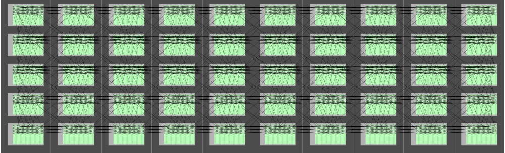
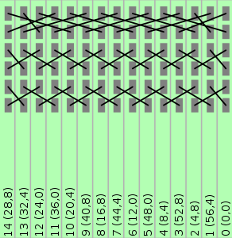
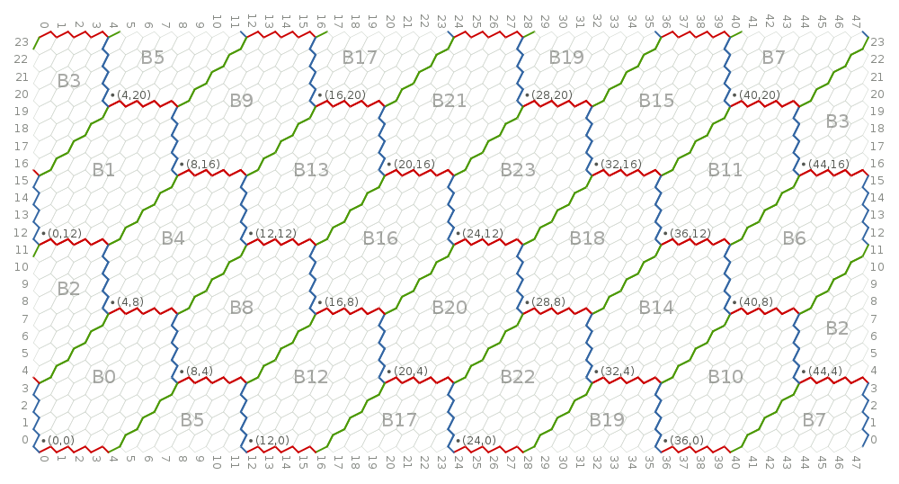
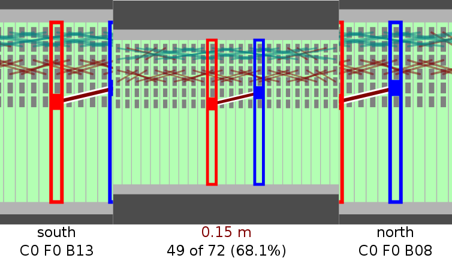

SpiNNer: SpiNNaker Wiring Tools
===============================

SpiNNer is a collection of tools for assisting with all stages of the process of
wiring up large SpiNNaker machines, from design to installation verification.

Installation
------------

SpiNNer has the following external dependencies (aside from Python 2.7+ or 3.4+):

| Dependency                                                  | Ubuntu Package | Fedora Package | Arch Package |
| ----------------------------------------------------------- | -------------- | -------------- | ------------ |
| [Cairo](http://cairographics.org/)                          | libcairo2-dev  | cairo-devel    | cairo        |
| [libffi](https://sourceware.org/libffi/)                    | libffi-dev     | libffi-devel   | libffi       |
| [Tkinter](https://docs.python.org/3.4/library/tkinter.html) | python-tk      | tkinter        | tk           |
| [Espeak](http://espeak.sourceforge.net/)                    | espeak         | espeak         | espeak       |

The easiest way to install the latest release of SpiNNer (along with other
Python packages it uses) to use use
[pip](https://pip.pypa.io/en/latest/installing.html):

	# pip install spinnaker_spinner

Documentation
-------------

You can read the latest version of SpiNNer's documentation on
[ReadTheDocs](http://spinner.readthedocs.org/en/stable/).

Quick Demos
-----------

Producing a wiring diagram for a 15-board machine:

	$ spinner-wiring-diagram -n 15 out.png

Producing a map from chip-position to physical location for a 24-board machine:

	$ spiner-machine-map -n 24 out.png	

Guiding manual installation of wires for a 24-board machine:

	$ spinner-wiring-guide -n 24 -l 0.15 0.30 --bmp 0 0 192.168.4.0

Finally, for a timelapse video of (an early version of) SpiNNer being used to
wire up a 120-board machine [head over to
YouTube](https://youtu.be/mcBB2o7Bmwc).

Author
------

The SpiNNer code base is the work of Jonathan Heathcote although the wiring
techniques used are based nearly in their entirety on extensive discussions with
Steve Furber, Jim Garside, Simon Davidson, Steve Temple and Luis Plana.

The default physical machine measurements used by SpiNNer were contributed by
Steve Temple.
