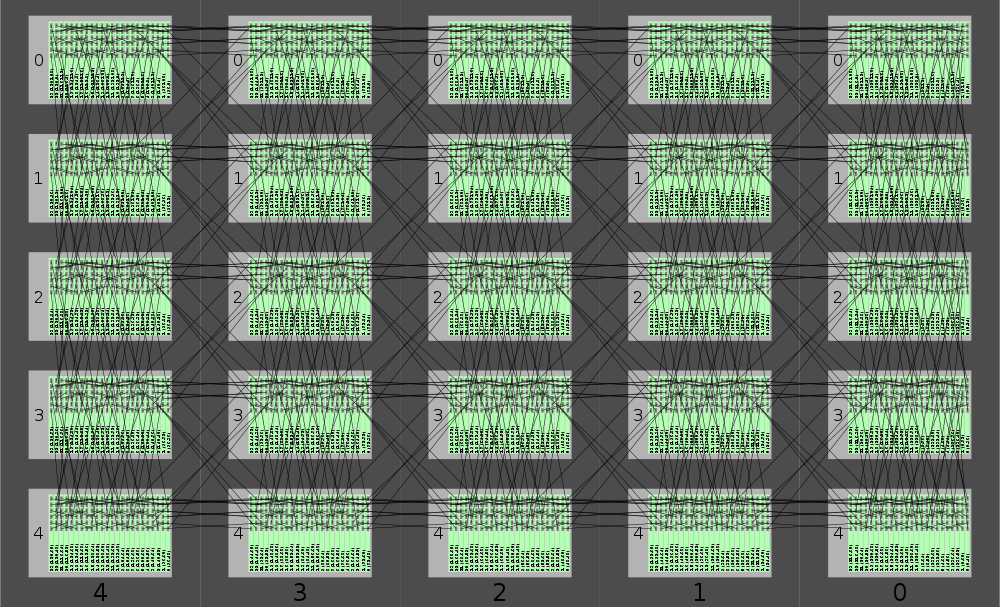

.. _spinner-wiring-diagram:

``spinner-wiring-diagram``
==========================

Generates illustrations of SpiNNaker machine wiring.

::

	$ spinner-wiring-diagram -h
	usage: spinner-wiring-diagram [-h] [--version]
	                              [--wire-thickness {thick,normal,thin}]
	                              [--highlight CABINET [FRAME [BOARD [{south,north,north-east,east,west,south-west}]]]
	                              [...]] [--hide-labels]
	                              (--num-boards N | --triads W H)
	                              [--transformation {shear,slice}]
	                              [--uncrinkle-direction {columns,rows}]
	                              [--folds X Y] [--board-dimensions W H D]
	                              [--board-wire-offset-south-west X Y Z]
	                              [--board-wire-offset-north-east X Y Z]
	                              [--board-wire-offset-east X Y Z]
	                              [--board-wire-offset-west X Y Z]
	                              [--board-wire-offset-north X Y Z]
	                              [--board-wire-offset-south X Y Z]
	                              [--inter-board-spacing S]
	                              [--boards-per-frame BOARDS_PER_FRAME]
	                              [--frame-dimensions W H D]
	                              [--frame-board-offset X Y Z]
	                              [--inter-frame-spacing S]
	                              [--frames-per-cabinet FRAMES_PER_CABINET]
	                              [--cabinet-dimensions W H D]
	                              [--cabinet-frame-offset X Y Z]
	                              [--inter-cabinet-spacing S] [--num-cabinets N]
	                              [--num-frames N]
	                              filename [width] [height]
	
	Generate illustrations of SpiNNaker machine wiring.
	
	optional arguments:
	  -h, --help            show this help message and exit
	  --version, -V         show program's version number and exit
	  --wire-thickness {thick,normal,thin}
	                        set the thickness of wires drawn (default: normal)
	  --highlight CABINET [FRAME [BOARD [{south,north,north-east,east,west,south-west}]]] [ ...]
	                        highlight a particular cabinet/frame/board/socket with
	                        a red border
	  --hide-labels, -L     hide board/frame/cabinet number labels
	
	image file parameters:
	  filename              filename to write the output to (.pdf or .png)
	  width                 width of the image in mm for PDF and pixels for PNG
	                        (defaults to 280 mm if PDF and 1000 px for PNG)
	  height                height of the image in mm for PDF and pixels for PNG
	                        (if only width is given, output will be at most width
	                        wide and width tall)
	
	machine topology dimensions:
	  --num-boards N, -n N  build the 'squarest' system with this many boards
	  --triads W H, -t W H  build a system with the specified number of triads of
	                        boards in each dimension (yielding 3*W*H boards)
	
	topology folding options:
	  --transformation {shear,slice}, -T {shear,slice}
	                        the transformation function to use from hexagonal
	                        torus to rectangular Cartesian grid (selected
	                        automatically if omitted)
	  --uncrinkle-direction {columns,rows}
	                        direction in which to uncrinkle the hexagonal mesh to
	                        form a regular grid (default: rows)
	  --folds X Y, -F X Y   the number of pieces to fold into in each dimension
	                        (default: (2, 2)) ignored if --transformation is not
	                        given
	
	board physical dimensions:
	  --board-dimensions W H D
	                        physical board dimensions in meters (default: (0.014,
	                        0.233, 0.24))
	  --board-wire-offset-south-west X Y Z
	                        physical offset of the south-west connector from board
	                        left-top-front corner in meters (default: (0.008,
	                        0.013, 0.0))
	  --board-wire-offset-north-east X Y Z
	                        physical offset of the north-east connector from board
	                        left-top-front corner in meters (default: (0.008,
	                        0.031, 0.0))
	  --board-wire-offset-east X Y Z
	                        physical offset of the east connector from board left-
	                        top-front corner in meters (default: (0.008, 0.049,
	                        0.0))
	  --board-wire-offset-west X Y Z
	                        physical offset of the west connector from board left-
	                        top-front corner in meters (default: (0.008, 0.067,
	                        0.0))
	  --board-wire-offset-north X Y Z
	                        physical offset of the north connector from board
	                        left-top-front corner in meters (default: (0.008,
	                        0.085, 0.0))
	  --board-wire-offset-south X Y Z
	                        physical offset of the south connector from board
	                        left-top-front corner in meters (default: (0.008,
	                        0.103, 0.0))
	  --inter-board-spacing S
	                        physical spacing between each board in a frame in
	                        meters (default: 0.00124)
	
	frame physical dimensions:
	  --boards-per-frame BOARDS_PER_FRAME
	                        number of boards per frame (default: 24)
	  --frame-dimensions W H D
	                        frame physical dimensions in meters (default: (0.43,
	                        0.266, 0.25))
	  --frame-board-offset X Y Z
	                        physical offset of the left-top-front corner of the
	                        left-most board from the left-top-front corner of a
	                        frame in meters (default: (0.06, 0.017, 0.0))
	  --inter-frame-spacing S
	                        physical spacing between frames in a cabinet in meters
	                        (default: 0.089)
	
	cabinet physical dimensions:
	  --frames-per-cabinet FRAMES_PER_CABINET
	                        number of frames per cabinet (default: 5)
	  --cabinet-dimensions W H D
	                        cabinet physical dimensions in meters (default: (0.6,
	                        1.822, 0.25))
	  --cabinet-frame-offset X Y Z
	                        physical offset of the left-top-front corner of the
	                        top frame from the left-top-front corner of a cabinet
	                        in meters (default: (0.085, 0.047, 0.0))
	  --inter-cabinet-spacing S
	                        physical spacing between each cabinet in meters
	                        (default: 0.0)
	  --num-cabinets N, -c N
	                        specify how many cabinets to spread the system over
	                        (default: the minimum possible)
	  --num-frames N, -f N  when only one cabinet is required, specifies how many
	                        frames within that cabinet the system should be spread
	                        across (default: the minimum possible)
	

Wiring diagrams
---------------

Small SpiNNaker machines can be assembled by following a printed wiring
diagram produced by ``spinner-wiring-diagram``::

	$ spinner-wiring-diagram -n 15 out.png

.. image:: single_frame_machine.png

The diagrams can be produced as either PNG or PDF files.

For diagrams with a large number of wires, the thickness of the wires drawn can
be modified with the ``--wire-thickness`` option to make them easier to follow::

	$ spinner-wiring-diagram -n 24 out.png --wire-thickness thin

.. image:: single_frame_machine_thin.png

.. _spinner-wiring-diagram-map:

Board-to-Chip Maps
------------------

By default, all boards, frames and cabinets are numbered with their physical
positions and also with the (X,Y) coordinate of the Ethernet connected chip on
each board::

	$ spinner-wiring-diagram -n 600 out.png

For a complementary visual mapping from SpiNNaker chip coordinates to physical
board positions, see the :ref:`spinner-machine-map <spinner-machine-map>`
command. Alternatively, for a machine-readable mapping, see the
:ref:`spinner-ethernet-chips <spinner-ethernet-chips>` command.

Images for presentations
------------------------

If a diagram is required for illustrative purposes, the labels can be omitted
using the ``--hide-labels`` option::

	$ spinner-wiring-diagram -n 1200 out.png --hide-labels

.. image:: full_machine.png
