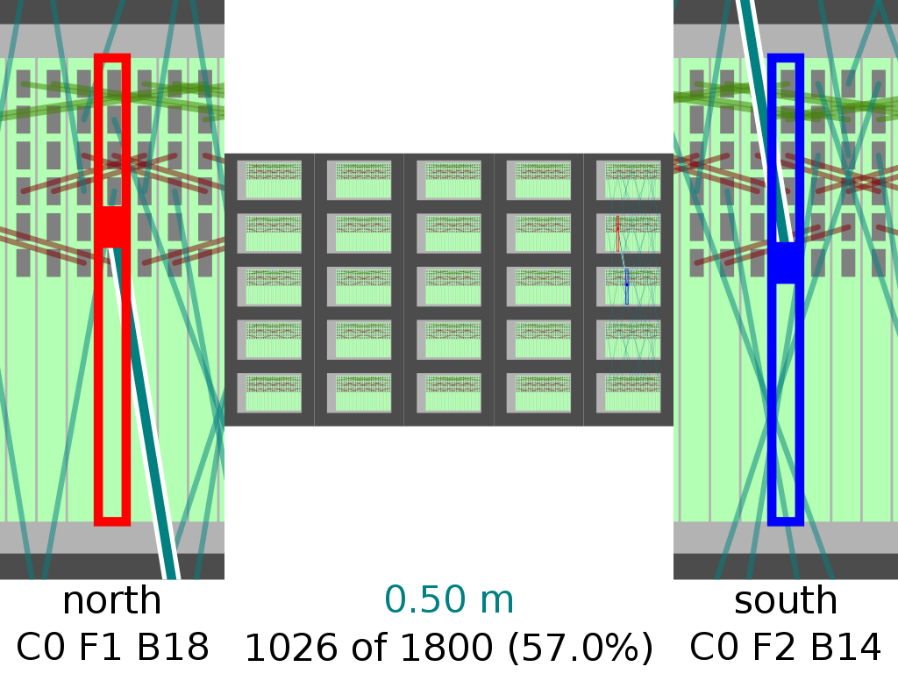

``spinner-wiring-guide``
========================

Interactively guides the user through the process of wiring up a SpiNNaker
machine and correcting wiring errors.

::

	$ spinner-wiring-guide -h
	usage: spinner-wiring-guide [-h] [--version] [--no-tts] [--no-auto-advance]
	                            [--fix] (--num-boards N | --triads W H)
	                            [--transformation {shear,slice}]
	                            [--uncrinkle-direction {columns,rows}]
	                            [--folds X Y] [--board-dimensions W H D]
	                            [--board-wire-offset-south-west X Y Z]
	                            [--board-wire-offset-north-east X Y Z]
	                            [--board-wire-offset-east X Y Z]
	                            [--board-wire-offset-west X Y Z]
	                            [--board-wire-offset-north X Y Z]
	                            [--board-wire-offset-south X Y Z]
	                            [--inter-board-spacing S]
	                            [--boards-per-frame BOARDS_PER_FRAME]
	                            [--frame-dimensions W H D]
	                            [--frame-board-offset X Y Z]
	                            [--inter-frame-spacing S]
	                            [--frames-per-cabinet FRAMES_PER_CABINET]
	                            [--cabinet-dimensions W H D]
	                            [--cabinet-frame-offset X Y Z]
	                            [--inter-cabinet-spacing S] [--num-cabinets N]
	                            [--num-frames N] [--wire-length L [L ...]]
	                            [--minimum-slack H] [--bmp CABINET FRAME HOSTNAME]
	
	Interactively guide the user through the process of wiring up a SpiNNaker
	machine.
	
	optional arguments:
	  -h, --help            show this help message and exit
	  --version, -V         show program's version number and exit
	  --no-tts              disable text-to-speech announcements of wiring steps
	  --no-auto-advance     disable auto-advancing through wiring steps
	  --fix                 detect errors in existing wiring and just show
	                        corrective steps
	
	machine topology dimensions:
	  --num-boards N, -n N  build the 'squarest' system with this many boards
	  --triads W H, -t W H  build a system with the specified number of triads of
	                        boards in each dimension (yielding 3*W*H boards)
	
	topology folding options:
	  --transformation {shear,slice}, -T {shear,slice}
	                        the transformation function to use from hexagonal
	                        torus to rectangular Cartesian grid (selected
	                        automatically if omitted)
	  --uncrinkle-direction {columns,rows}
	                        direction in which to uncrinkle the hexagonal mesh to
	                        form a regular grid (default: rows)
	  --folds X Y, -F X Y   the number of pieces to fold into in each dimension
	                        (default: (2, 2)) ignored if --transformation is not
	                        given
	
	board physical dimensions:
	  --board-dimensions W H D
	                        physical board dimensions in meters (default: (0.014,
	                        0.233, 0.24))
	  --board-wire-offset-south-west X Y Z
	                        physical offset of the south-west connector from board
	                        left-top-front corner in meters (default: (0.008,
	                        0.013, 0.0))
	  --board-wire-offset-north-east X Y Z
	                        physical offset of the north-east connector from board
	                        left-top-front corner in meters (default: (0.008,
	                        0.031, 0.0))
	  --board-wire-offset-east X Y Z
	                        physical offset of the east connector from board left-
	                        top-front corner in meters (default: (0.008, 0.049,
	                        0.0))
	  --board-wire-offset-west X Y Z
	                        physical offset of the west connector from board left-
	                        top-front corner in meters (default: (0.008, 0.067,
	                        0.0))
	  --board-wire-offset-north X Y Z
	                        physical offset of the north connector from board
	                        left-top-front corner in meters (default: (0.008,
	                        0.085, 0.0))
	  --board-wire-offset-south X Y Z
	                        physical offset of the south connector from board
	                        left-top-front corner in meters (default: (0.008,
	                        0.103, 0.0))
	  --inter-board-spacing S
	                        physical spacing between each board in a frame in
	                        meters (default: 0.00124)
	
	frame physical dimensions:
	  --boards-per-frame BOARDS_PER_FRAME
	                        number of boards per frame (default: 24)
	  --frame-dimensions W H D
	                        frame physical dimensions in meters (default: (0.43,
	                        0.266, 0.25))
	  --frame-board-offset X Y Z
	                        physical offset of the left-top-front corner of the
	                        left-most board from the left-top-front corner of a
	                        frame in meters (default: (0.06, 0.017, 0.0))
	  --inter-frame-spacing S
	                        physical spacing between frames in a cabinet in meters
	                        (default: 0.133)
	
	cabinet physical dimensions:
	  --frames-per-cabinet FRAMES_PER_CABINET
	                        number of frames per cabinet (default: 5)
	  --cabinet-dimensions W H D
	                        cabinet physical dimensions in meters (default: (0.6,
	                        2.0, 0.25))
	  --cabinet-frame-offset X Y Z
	                        physical offset of the left-top-front corner of the
	                        top frame from the left-top-front corner of a cabinet
	                        in meters (default: (0.085, 0.047, 0.0))
	  --inter-cabinet-spacing S
	                        physical spacing between each cabinet in meters
	                        (default: 0.0)
	  --num-cabinets N, -c N
	                        specify how many cabinets to spread the system over
	                        (default: the minimum possible)
	  --num-frames N, -f N  when only one cabinet is required, specifies how many
	                        frames within that cabinet the system should be spread
	                        across (default: the minimum possible)
	
	available wire lengths:
	  --wire-length L [L ...], -l L [L ...]
	                        specify one or more available wire lengths in meters
	  --minimum-slack H     the minimum slack to allow in a wire connecting two
	                        boards in meters
	
	SpiNNaker BMP connection details:
	  --bmp CABINET FRAME HOSTNAME
	                        specify the hostname of a BMP to use to communicate
	                        with SpiNNaker boards in the given frame

User Interface
--------------

The screen shot above shows the wiring guide being used to wire up a 600 board
system.

The centre of the display shows an overview of the whole machine and indicates
wires that have already been installed and are coloured based on the length of
the cable used. The boards and sockets to be connected are highlighted and a
close-up view of the two endpoints is shown on the left- and right-hand side of
the display.

Underneath the diagrams, the central caption indicates the length of wire to use
for the current connection and the current progress through the whole job. The
left and right captions indicate the positions of the specific boards to be
connected (in terms of their cabinet, frame and board numbers).

When each wire is installed, SpiNNer verbally announces the next connection to
be made using text-to-speech (TTS). Additionally, when appropriate command-line
options are given, SpiNNer also illuminates a red LED on the pair of boards
which are to be connected. Further, SpiNNer can automatically check for the
correct installation of each wire and automatically advance to the next wire
when a successful connection is made.

The length of each wire to be installed is selected by the same method as the
``spinner-wiring-stats`` tool. The order of wire installation proceeds in three
broad phases:

* Within frames
* Between frames
* Between cabinets

Additionally, the tightest wires are installed first such that newly inserted
wires can be installed over the top of existing wires.

The following keys are used to interact with the wiring guide:

============================  ==========================
Purpose                       Key
============================  ==========================
Move to next wire             Left-click, Down, Space
Skip forward multiple wires   Page-Down
Move to previous wire         Right-click, Up, Backspace
Skip backward multiple wires  Page-Up
Go to first wire              Home
Go to last wire               End
Toggle Text-to-Speech         t
Toggle Auto-Advance           a
============================  ==========================

Future versions of this tool hope to include the ability to organise multiple
people simultaneously in the installation of very large systems.

Standalone Usage
----------------

To run the wiring tool stand-alone without connecting to the SpiNNaker machine
being assembled, simply supply a system size and a set of available wire lengths::

	$ spinner-wiring-guide -n 1200 -l 0.15 0.30 0.50 1.00

Illuminating LEDs and On-the-Fly Wire Checking
----------------------------------------------

``spinner-wiring-guide`` can illuminate a red LED on boards whose wires are to
be connected and also check wires are inserted on-the-fly. To enable this
feature, ensure all boards are powered on (e.g. using ``rig-power BMP_HOSTNAME
on -b 0-23`` for each frame) and then use::

	$ spinner-wiring-guide -n 24 -l 0.15 0.30 0.50 1.00 --bmp 0 0 BMP_HOSTNAME

Note that the ``--bmp`` argument must be given once for each frame in the
system.

Just Illuminating LEDs
----------------------

If you do not wish to power-up the system while wiring it up, LEDs can still be
illuminated while disabling the wire-checking feature using the
``--no-auto-advance`` argument::

	$ spinner-wiring-guide -n 24 -l 0.15 0.30 0.50 1.00 --bmp 0 0 BMP_HOSTNAME --no-auto-advance

.. _spinner-wiring-guide-fix:

Repairing wiring errors
-----------------------

Adding the ``--fix`` option will check all installed wires in the machine and
guide you through any corrections which must be made::

	$ spinner-wiring-guide -n 24 -l 0.15 0.30 0.50 1.00 --bmp 0 0 BMP_HOSTNAME --fix
